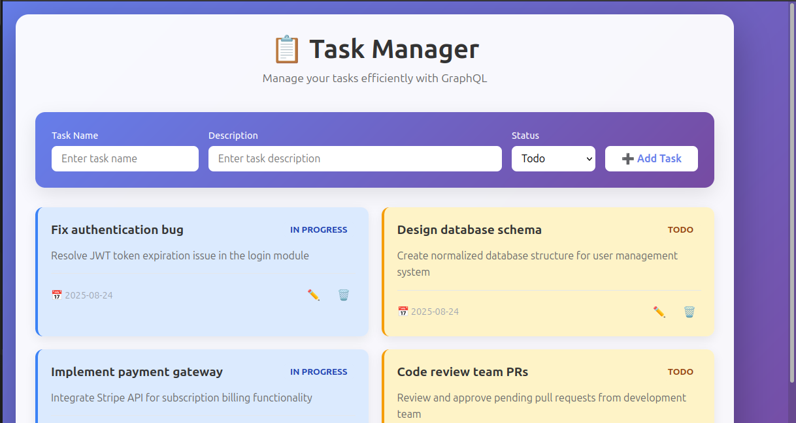

Here’s a clean **README.md** for your project:

```markdown
# 📝 Task Manager (GraphQL + React)

A simple **Task Manager** web app built with **React (frontend)** and **Node.js + Express + GraphQL (backend)**.  
You can create, update, and delete tasks with real-time updates from a GraphQL API.  

---

## 🚀 Live Links
- **Frontend:** [https://task-manager-beryl-mu.vercel.app/](https://task-manager-beryl-mu.vercel.app/)  
- **Backend (GraphQL API):** [https://task-manager-mx88.onrender.com/](https://task-manager-mx88.onrender.com/)  

---

## 📂 Project Structure
```

.
├── backend/           # Node.js + Express + GraphQL server
│   ├── index.js       # Entry point and graphql schema
│   └── package.json   # Backend dependencies
│
└── frontend/          # React frontend (Vite or CRA)
├── src/
│   ├── App.jsx
│   ├── App.css
│   └── components/
└── package.json   # Frontend dependencies

````

---

## 🛠️ Tech Stack
### Frontend
- React (with Hooks)
- Fetch API for GraphQL queries/mutations
- CSS for styling
- Deployed on **Vercel**

### Backend
- Node.js + Express
- GraphQL (express-graphql)
- CORS for secure API access
- Deployed on **Render**

---

## 🔑 Features
✅ View all tasks (GraphQL `tasks` query)  
✅ Add new tasks (GraphQL `addTask` mutation)  
✅ Edit task details (GraphQL `updateTask` mutation)  
✅ Delete tasks (GraphQL `deleteTask` mutation)  
✅ Clean, responsive UI  

---

## 📦 Installation & Setup (Local)

### 1. Clone the repository
```bash
git clone <your-repo-url>
cd <repo-name>
````

### 2. Backend Setup

```bash
cd backend
npm install
npm start
```

Server will run on `http://localhost:4000/graphql`

### 3. Frontend Setup

```bash
cd ../frontend
npm install
npm run dev
```

Frontend will run on `http://localhost:5173`

---

## 🔗 API Example (GraphQL)

Example query to get tasks:

```graphql
query {
  tasks {
    id
    name
    description
    status
    timeStamp
  }
}
```

Example mutation to add a task:

```graphql
mutation {
  addTask(name: "New Task", description: "Task details", status: "Todo") {
    id
    name
    status
  }
}
```

---

## 🖼️ Screenshots



---

## 🧾 License

This project is open-source and available under the [MIT License](LICENSE).

```